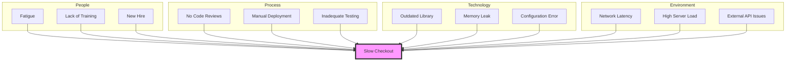

# Structured Problem-Solving: From Chaos to Clarity

## The Scenario

A critical production system is experiencing intermittent performance degradation. Users report random slowdowns, but there's no clear pattern. Some engineers jump to conclusions: "It must be the database." Others start making changes based on hunches: "Let's increase the cache size." Still others are paralyzed by the complexity: "There are too many variables to know where to start." After a week of reactive changes and false leads, the team is no closer to a solution, and the problem is getting worse.

This scenario illustrates what happens when teams lack a structured approach to problem-solving. Complex technical problems can't be solved through intuition alone. As a Staff Engineer, your value comes not just from technical knowledge but from your ability to bring order to chaos through structured problem-solving methodologies. When others are reacting, you need to be methodical.

## The Power of Structure in Problem-Solving

Structured problem-solving provides several critical benefits:

1. **Prevents premature solutions** that address symptoms rather than root causes
2. **Creates shared understanding** across team members with different perspectives
3. **Reduces cognitive bias** by forcing explicit consideration of multiple hypotheses
4. **Enables delegation** by breaking complex problems into discrete components
5. **Provides confidence** in the solution by showing the reasoning process
6. **Creates documentation** of both the problem and its resolution

## A Universal Problem-Solving Framework

While many problem-solving frameworks exist, most follow these fundamental steps:

### 1. Define the Problem

Begin by creating a clear, specific problem statement. A well-defined problem is already half-solved.

**Key Activities:**

- Distinguish symptoms from the problem itself
- Define what "solved" looks like with measurable criteria
- Establish the scope and boundaries of the problem
- Identify stakeholders and impacts

**Poor Problem Statement:** "The system is slow."

**Better Problem Statement:** "During peak hours (9-11am ET), the checkout process intermittently takes >5 seconds to complete, up from a normal <500ms response time. This affects approximately 15% of transactions and began after the deployment on March 15th."

### 2. Gather Information

Collect relevant data to understand the problem's context and potential causes.

**Key Activities:**

- Review system metrics and logs
- Document the timeline of related events
- Interview users or stakeholders
- Analyze patterns and correlations
- Map the system components involved

**Effective Information Gathering Questions:**

- "When exactly does the problem occur? When does it not occur?"
- "What changed around the time the problem started?"
- "Are there any patterns in affected users, transactions, or data?"
- "What metrics correlate with the problem's occurrence?"

### 3. Generate Hypotheses

Develop multiple potential explanations for the observed problem.

**Key Activities:**

- Brainstorm possible causes without immediate judgment
- Consider issues across different system layers
- Use the process of elimination for simpler problems
- Draw on past experiences with similar issues

**Example Hypotheses for Slow Checkout:**

- Database connection pool exhaustion
- Network latency between services
- Resource contention from new background process
- Memory leak in the payment service
- Third-party payment processor degraded performance

### 4. Test Hypotheses

Design and execute experiments to validate or invalidate each hypothesis.

**Key Activities:**

- Prioritize tests based on likelihood and ease of verification
- Define expected outcomes before testing
- Create isolated tests that target specific hypotheses
- Document all results, even negative ones

**Example Test Plan:**

- Check database connection pool metrics during slow periods
- Run network diagnostics between service nodes
- Monitor memory usage in the payment service over time
- Compare slow transactions against payment provider
- Temporarily disable new background process

### 5. Implement Solutions

Based on validated hypotheses, design and implement appropriate solutions.

**Key Activities:**

- Address root causes, not just symptoms
- Consider short-term fixes vs. long-term solutions
- Evaluate solution trade-offs and potential side effects
- Plan for validation after implementation

**Implementation Approaches:**

- Incremental: Make small changes with quick feedback loops
- Parallel: Test multiple solutions simultaneously
- Phased: Deploy to limited environments or users first
- Complete: Full implementation when confidence is high

### 6. Reflect and Learn

After resolving the problem, capture lessons learned to improve future problem-solving.

**Key Activities:**

- Document the problem, process, and solution
- Update monitoring and alerting to catch similar issues
- Identify preventive measures for similar problems
- Review the problem-solving process itself for improvements

## Specialized Problem-Solving Frameworks

Different types of problems benefit from tailored approaches. Here are three powerful frameworks for specific contexts:

### The Five Whys: For Root Cause Analysis

Developed by Toyota, this technique involves asking "why" repeatedly to dig beneath surface symptoms to root causes.

**Example Application:**

- Problem: Users experience slow checkout
- Why? The payment service is responding slowly
- Why? The service is running out of database connections
- Why? Connections aren't being released properly
- Why? The error handling code doesn't close connections
- Why? The exception handling was refactored without testing this edge case

**Best For:** Incidents and defects with clear causal chains

**Limitations:** Can oversimplify complex problems with multiple contributing factors

### The Scientific Method: For Complex Technical Debugging

This classic approach works well for performance issues, bugs, and system behavior problems.

**Steps:**

1. Observe: Document the problematic behavior precisely
2. Question: Ask what could explain the observations
3. Hypothesize: Formulate testable explanations
4. Predict: What should happen if the hypothesis is correct?
5. Test: Design experiments to validate or invalidate
6. Analyze: Interpret the results
7. Conclude: Determine the most likely explanation
8. Iterate: Refine hypotheses based on new information

**Best For:** Hard-to-reproduce issues and complex system interactions

**Limitations:** Can be time-consuming for straightforward problems

### OODA Loops: For Rapid Adaptation

Developed by military strategist John Boyd, the OODA Loop (Observe, Orient, Decide, Act) is a decision-making framework that emphasizes speed and agility. It's ideal for dynamic environments where conditions change rapidly.

- **Observe:** Gather raw data about the situation (e.g., system metrics, alerts, user feedback).
- **Orient:** Synthesize the data, apply context, and form a mental model of the problem.
- **Decide:** Formulate a specific course of action.
- **Act:** Execute the decision and immediately begin observing the results to start the loop again.

**Best For:** Incident response, live debugging, and rapidly evolving situations.

**Limitations:** Can lead to reactive decisions if the "Orient" phase is rushed.

### Force Field Analysis: For Strategic Change

This strategic planning tool helps you identify and manage the forces that either support or resist a proposed change. It's invaluable for large-scale initiatives like system migrations or architectural shifts.

- **Driving Forces:** Factors that promote the change (e.g., improved performance, reduced costs).
- **Restraining Forces:** Factors that oppose the change (e.g., budget constraints, technical complexity, team resistance).

By mapping these forces, you can develop strategies to strengthen drivers and weaken restrainers.

**Best For:** Planning major technical changes and managing stakeholder alignment.

**Limitations:** Can oversimplify complex human and organizational factors.

### TRIZ (Theory of Inventive Problem Solving): For Design Challenges

This framework focuses on identifying contradictions in requirements and finding principles to resolve them.

**Key Concepts:**

- Technical contradictions: When improving one parameter worsens another
- Physical contradictions: When something needs opposing states
- 40 inventive principles to resolve contradictions
- Patterns of evolution that technical systems follow

**Example Application:** A system needs both high throughput and low latency

**Best For:** Engineering design problems with competing constraints

**Limitations:** Steep learning curve, best for complex innovation challenges

## Problem-Solving Antipatterns to Avoid

Watch for these common pitfalls in your problem-solving process:

### 1. Solution Jumping

**The Antipattern:** Proposing solutions before properly understanding the problem

**Warning Signs:**

- Discussion of solutions in the first minutes of addressing a problem
- Multiple competing solution proposals with no clear problem definition
- "I've seen this before, we just need to..."

**Better Approach:** Force the team to spend at least 25% of available time defining the problem and gathering information before discussing solutions

### 2. The Hammer Syndrome

**The Antipattern:** Favoring familiar tools or approaches regardless of fit ("When all you have is a hammer, everything looks like a nail")

**Warning Signs:**

- Proposing the same solution approach for different problems
- Solutions that align with team expertise rather than problem needs
- Dismissing alternatives without consideration

**Better Approach:** Explicitly list multiple solution approaches with pros and cons before selecting one

### 3. Analysis Paralysis

**The Antipattern:** Getting stuck in endless information gathering and hypothesizing without action

**Warning Signs:**

- Multiple meetings with no decisions or actions
- Constantly requesting more data
- Inability to prioritize hypotheses

**Better Approach:** Set time boxes for each phase of problem-solving and force decisions with available information

## Problem-Solving Tools for Staff Engineers

These tools can enhance your problem-solving toolkit:

### 1. Fishbone (Ishikawa) Diagrams

Visualize potential causes organized into categories (People, Process, Technology, Environment).

**When to Use:** Early in problem investigation to organize potential causes

**Example:**



### 2. A3 Problem-Solving

A structured one-page problem-solving document with these sections:

1. Background
2. Current Condition
3. Goal/Target Condition
4. Root Cause Analysis
5. Countermeasures
6. Implementation Plan
7. Follow-up Actions

**When to Use:** For visible problems requiring cross-team collaboration

### 3. Decision Matrices

Evaluate potential solutions against weighted criteria to make objective choices.

**When to Use:** When comparing multiple viable solutions

**Example:**

```
Solution Options | Performance (x3) | Cost (x2) | Implementation Time (x1) | Total Score
-------------------|-----------------|-----------|--------------------------|------------
Option A           | 4 (12)          | 3 (6)     | 5 (5)                    | 23
Option B           | 5 (15)          | 2 (4)     | 2 (2)                    | 21
Option C           | 3 (9)           | 5 (10)    | 4 (4)                    | 23
```

### 4. Pre-Mortem Analysis

Imagine the proposed solution has failed and work backward to identify potential issues.

**When to Use:** Before implementing solutions to identify risks

**Example Questions:**

- "It's six months later and our solution has completely failed. What happened?"
- "What risks or assumptions might we be missing?"
- "Which stakeholders might be negatively impacted?"

## Facilitating Structured Problem-Solving as a Staff Engineer

As a technical leader, your role is often to guide the problem-solving process rather than solve everything yourself:

### 1. Set the Frame

- Start meetings with clear problem statements
- Establish and enforce the problem-solving process
- Set expectations for evidence-based reasoning
- Make the methodology explicit

### 2. Ask Powerful Questions

- "How would we measure success?"
- "What data would help us distinguish between these hypotheses?"
- "What assumption are we making that, if wrong, would change our approach?"
- "What's the simplest experiment we could run to test this?"

### 3. Manage Cognitive Biases

- Challenge confirmation bias: "What evidence would contradict our current thinking?"
- Address recency bias: "Have we seen similar problems in other systems?"
- Counter authority bias: "Let's hear from everyone before the senior people share their views"

### 4. Document the Journey

- Capture the problem-solving process, not just the solution
- Create artifacts that outlive the immediate problem
- Build a knowledge base of solved problems
- Update runbooks and post-mortem templates

By applying structured problem-solving approaches, you transform your team from reactive firefighters to methodical investigators. This not only leads to more effective solutions but builds organizational capability to handle increasingly complex challenges.

## Cross-Reference Navigation

### Prerequisites for This Chapter

- **[Mental Models](mental-models.md)** - Understanding mental models provides the cognitive foundation for structured problem-solving
- **[Decision-Making Frameworks](../execution/decision-making-frameworks.md)** - Basic decision-making skills are essential for effective problem-solving

### Related Concepts

- **[Mental Models](mental-models.md)** - Mental models help structure how we understand and approach problems
- **[Decision-Making Frameworks](../execution/decision-making-frameworks.md)** - Problem-solving and decision-making frameworks complement each other
- **[Cognitive Biases](cognitive-biases.md)** - Recognizing cognitive biases is essential for objective problem analysis
- **[Navigating Uncertainty](../execution/navigating-uncertainty.md)** - Structured approaches help manage uncertainty in complex problems

### Apply These Concepts

- **[Staff Engineer Competency Assessment](../../appendix/tools/staff-engineer-competency-assessment.md)** - Evaluate your problem-solving and critical thinking capabilities
- **[Development Tracking System](../../appendix/tools/development-tracking-system.md)** - Track your progress in developing systematic problem-solving skills

### Next Steps in Your Learning Journey

1. **[Decision-Making Frameworks](../execution/decision-making-frameworks.md)** - Learn to apply decision-making frameworks to complex technical choices
2. **[Navigating Uncertainty](../execution/navigating-uncertainty.md)** - Master approaches to handling ambiguous and uncertain situations
3. **[Mental Models](mental-models.md)** - Deepen your understanding of cognitive frameworks that support problem-solving

## A Practical Exercise: The Scenario Challenge

- **Objective:** To practice applying structured problem-solving frameworks to a complex, ambiguous problem.
- **Setup:** Divide participants into small teams. Provide each team with a scenario requiring a decision (e.g., "A critical service is experiencing intermittent latency, and the cause is unknown.").
- **Execution:** Ask each team to choose a suitable framework (like the 5 Whys or a Fishbone Diagram), apply it to the scenario, document their process, and present their findings and proposed next steps.
- **Debrief:** Facilitate a discussion on the rationale behind their choice, the challenges they encountered, and how a structured approach helped them move from ambiguity to a clear plan.

## Further Reading

**Problem-Solving Methodologies:**

- Reston, James R. _Problem Solving with Root Cause Analysis_. 2nd edition, 2016. (Systematic approach to identifying and solving root causes in technical and organizational problems)
- Rother, Mike. _Toyota Kata: Managing People for Improvement, Adaptiveness, and Innovation_. 2009. (Scientific approach to continuous improvement and problem-solving based on Toyota's systematic methods)
- Kepner, Charles H., and Benjamin B. Tregoe. _The New Rational Manager: An Updated Edition for a New World_. 2013. (Classic systematic approach to problem analysis and decision-making in complex environments)

**Systems Thinking and Analysis:**

- Senge, Peter M. _The Fifth Discipline: The Art and Practice of the Learning Organization_. 2006. (Systems thinking approach to understanding complex organizational and technical problems)
- Meadows, Donella H. _Thinking in Systems: A Primer_. 2008. (Introduction to systems thinking principles for understanding interconnected problems and solutions)
- Ackoff, Russell L. _The Art of Problem Solving: Accompanied by Ackoff's Fables_. 1987. (Advanced problem-solving concepts including problem dissolution and systems design thinking)

**Technical Problem-Solving Applications:**

- Allspaw, John. _Web Operations: Keeping the Data On Time_. 2010. (Structured approaches to operational problem-solving and incident response in technical environments)
- Humble, Jez, Joanne Molesky, and Barry O'Reilly. _Lean Enterprise: How High Performance Organizations Innovate at Scale_. 2014. (Problem-solving frameworks for technical transformation and organizational change)
- Goldratt, Eliyahu M., and Jeff Cox. _The Goal: A Process of Ongoing Improvement_. 2012. (Theory of constraints approach to identifying and solving systematic bottlenecks and performance problems)
