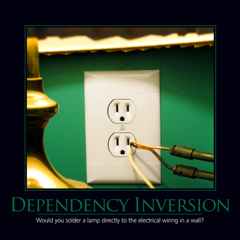

# Dependency Inversion Principle: Building Robust, Maintainable Systems



## The Problem: Tightly Coupled Systems

Imagine building a complex e-commerce application. You have a user interface, a business logic layer handling product details and order processing, and a data access layer responsible for interacting with your database. If you implement this system without considering the Dependency Inversion Principle (DIP), you’re likely to create a tightly coupled mess. This means that components are directly dependent on each other’s specific implementations – a very fragile situation prone to breaking changes and difficult to maintain.

The core issue arises when your modules directly instantiate each other. For example, the UI might directly create instances of the BLL, which in turn creates instances of the DAL, which interacts with the database. This “New is Glue” pattern, while seemingly efficient, creates a brittle dependency chain. A change in the DAL’s implementation (e.g., switching to a different database technology) requires you to modify _every_ module that depends on it. The resulting ripple effect is a major risk.

## Defining the Dependency Inversion Principle

The Dependency Inversion Principle, championed by Robert C. Martin (Uncle Bob), states: “High-level modules should not depend on low-level modules. Both should depend on abstractions.” Let's break that down:

- **Abstractions:** These are interfaces or abstract classes that define _what_ a component does, without specifying _how_ it does it. Think of them as contracts – clear specifications of behavior.
- **High-Level Modules:** These are the more general, conceptual components of your system (e.g., the UI, the business logic).
- **Low-Level Modules:** These are the concrete implementations of those components (e.g., the specific DAL implementation for MySQL).

The essence of DIP is to decouple these layers. Instead of directly instantiating each other, high-level modules should depend on abstractions, and low-level modules should implement those abstractions.

## Example: E-Commerce Order Processing

Let’s illustrate this with a simplified e-commerce order processing scenario.

**Without DIP (The Bad Way):**

```java
// UI
public class ShoppingCartUI {
    private OrderProcessingService orderService;
    public ShoppingCartUI(OrderProcessingService orderService) {
        this.orderService = orderService;
    }

    public void placeOrder(ShoppingCart cart) {
        Order order = orderService.processOrder(cart);
        // ... display order confirmation ...
    }
}

// OrderProcessingService (Low Level)
public class OrderProcessingService {
    private PaymentGateway paymentGateway;
    public OrderProcessingService(PaymentGateway paymentGateway) {
        this.paymentGateway = paymentGateway;
    }

    public Order processOrder(ShoppingCart cart) {
        // ... process payment ...
        Order order = new Order(cart); // Create new order
        return order;
    }
}

// PaymentGateway (Low Level)
public interface PaymentGateway {
    void processPayment(Order order);
}

// Concrete PaymentGateway Implementation
public class StripePaymentGateway implements PaymentGateway {
    @Override
    public void processPayment(Order order) {
        // ... use Stripe API to process payment ...
    }
}
```

Notice how `ShoppingCartUI` directly creates an instance of `StripePaymentGateway`. A change in the payment gateway (e.g., switching to PayPal) requires modification of the `ShoppingCartUI` class.

**With DIP (The Good Way):**

```java
// UI
public class ShoppingCartUI {
    private OrderProcessor orderProcessor;
    public ShoppingCartUI(OrderProcessor orderProcessor) {
        this.orderProcessor = orderProcessor;
    }

    public void placeOrder(ShoppingCart cart) {
        Order order = orderProcessor.processOrder(cart);
        // ... display order confirmation ...
    }
}

// OrderProcessor (Abstraction - High Level)
public interface OrderProcessor {
    Order processOrder(ShoppingCart cart);
}

// Concrete OrderProcessor Implementation
public class OrderProcessingService implements OrderProcessor {
    private PaymentGateway paymentGateway;
    public OrderProcessingService(PaymentGateway paymentGateway) {
        this.paymentGateway = paymentGateway;
    }

    @Override
    public Order processOrder(ShoppingCart cart) {
        Order order = new Order(cart); // Create new order
        // ... process payment ...
        return order;
    }
}

// PaymentGateway (Low Level)
public interface PaymentGateway {
    void processPayment(Order order);
}

// Concrete PaymentGateway Implementation
public class StripePaymentGateway implements PaymentGateway {
    @Override
    public void processPayment(Order order) {
        // ... use Stripe API to process payment ...
    }
}
```

Now, `ShoppingCartUI` simply depends on the `OrderProcessor` interface. We can swap out the `OrderProcessingService` implementation without changing the `ShoppingCartUI`. This illustrates the power of DIP – it dramatically increases flexibility and reduces coupling.

## Practical Implications & Best Practices

- **Dependency Injection (DI):** DI is the most common way to implement DIP. It involves providing dependencies to a class from an external source (e.g., a constructor, setter method, or interface). This allows you to control which implementations are used.
- **Interfaces:** Use interfaces liberally to define abstractions.
- **Avoid Concrete Classes:** Minimize direct instantiation of concrete classes within higher-level modules.
- **Testing:** DIP makes your code much easier to test – you can easily mock or stub dependencies.

## Examples Across Domains

- **Web Applications:** Dependency injection frameworks (Spring, Guice) are widely used to manage dependencies in Java web applications.
- **Data Access:** Abstracting the data access layer with repositories (using patterns like Repository) based on interfaces facilitates switching databases.
- **Microservices:** DIP is foundational to microservices architecture, allowing teams to independently evolve services.

## Call to Action: Embrace DIP

Mastering the Dependency Inversion Principle is not just about following a rule – it’s about building robust, maintainable, and adaptable systems. By embracing this principle, you'll reduce technical debt, improve collaboration, and create software that can evolve with your business needs. Start small – identify a tightly coupled component in your current project and consider how you can introduce an abstraction. The benefits – reduced risk, increased agility, and a clearer architectural vision – are well worth the effort. Don't just write code; build resilient systems.

```

```
