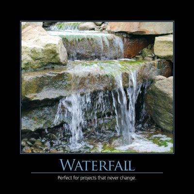

# Understanding the Waterfall Model: A Critical Examination

date: "2014-11-27"
description: "The Waterfall model, a traditional software development lifecycle, presents significant challenges in today’s dynamic environments. This article explores its fundamental flaws and offers guidance for navigating its potential pitfalls. Understanding its weaknesses is crucial for effective software development, particularly in complex, evolving projects."



## Introduction: The Myth of Linear Progress

The Waterfall model – often nicknamed “Waterfail” – represents a sequential approach to software development. It’s characterized by distinct, non-overlapping phases: Requirements Gathering, Design, Implementation (Coding), Testing, Deployment, and Maintenance. While seemingly straightforward, this model has historically been a dominant force in the industry. However, its rigidity makes it profoundly ill-suited for many modern software development scenarios. The core issue isn't simply the _order_ of the phases, but rather the assumption that each phase must be _completely_ finished before the next can begin. This creates a significant bottleneck and dramatically increases the risk of delivering a product that doesn’t meet evolving needs.

## Why Waterfall is Problematic: A Real-World Perspective

The Waterfall model's fundamental problem lies in its inability to cope with change. Consider the analogy to bridge construction. Building a bridge, as a physical structure, is a well-defined process governed by established engineering principles. The requirements are relatively stable, and deviations are exceptionally costly. Changes necessitate restarting significant portions of the project. However, software is fundamentally different. Requirements, user needs, and technological landscapes shift constantly. Attempting to impose a rigid, sequential process on this volatile environment is a recipe for disaster.

Let's contrast this with a common engineering scenario: designing a new web application for an e-commerce platform. Initially, the team might define requirements for “user authentication” – creating accounts, logging in, etc. But as the system evolves, users demand features like “wish lists,” “recommendations,” and “social sharing.” Trying to force these requirements into the original, fixed design is almost guaranteed to result in a product that’s incomplete, outdated, and ultimately, unusable.

## The Core Flaw: The Illusion of Certainty

The Waterfall model operates on the deeply flawed assumption that we can _perfectly_ define all requirements upfront. In reality, requirements are rarely, if ever, fully understood at the beginning of a project. Ambiguity, incomplete information, and changing priorities are inherent in most software development endeavors. Treating these as fixed constraints leads to excessive documentation, protracted design phases, and ultimately, a system that’s built on a false premise.

Imagine a team tasked with building a new mobile app for a retail chain. They might start by gathering requirements for "product browsing" – allowing customers to search for items. But as they build this feature, they discover that customers also want the ability to “create shopping lists,” “compare prices,” and “receive personalized recommendations.” Attempting to accommodate all of these needs within the rigid structure of the Waterfall model would result in a significantly delayed launch and a potentially unusable product.

## The Impact of Batch Size: A Lean Perspective

The challenges of the Waterfall model are further exacerbated by the concept of "batch size." The model inherently encourages large batches of work. For example, a team might spend months completely documenting all of the requirements for a user interface, before even starting to design the actual UI. This approach creates a significant time lag, making the system vulnerable to changes in market demand or user expectations.

Lean methodologies, particularly those focused on value stream mapping, highlight the dangers of large batch sizes. Reducing batch sizes – processing smaller, more frequent iterations – drastically improves quality, reduces waste, and accelerates flow. In the retail app example, instead of developing the entire user interface in one massive batch, the team could iteratively develop and release smaller, feature-rich increments – perhaps starting with basic product browsing and then adding features like wish lists and recommendations over time.

## Practical Considerations & Mitigation Strategies

Even if a project _requires_ some adherence to a structured process, understanding the weaknesses of the Waterfall model is paramount. Here’s how to mitigate its risks:

- **Iterative Development:** Embrace iterative approaches, such as Agile methodologies, that allow for frequent feedback, adaptation, and course correction.
- **Minimum Viable Product (MVP):** Focus on building and releasing a basic version of the product quickly, gathering user feedback, and then iterating based on that feedback.
- **Prioritization:** Implement robust prioritization frameworks to ensure the team is working on the most valuable features first.
- **Change Management:** Establish a clear process for managing and incorporating changes to requirements – acknowledging that change is inevitable and building flexibility into the development process.

## Conclusion: A Call to Action

Mastering the weaknesses of the Waterfall model isn't about abandoning structure. Instead, it's about approaching software development with a critical eye – recognizing the inherent risks of a rigid, sequential process and proactively implementing strategies to mitigate those risks. By understanding the core flaws of the Waterfall model, you can become a more effective and adaptable software developer, delivering valuable solutions that meet the ever-changing needs of your users and your business. Investing time in this understanding will ultimately lead to more successful projects, reduced rework, and faster time-to-market.

References:

- Waterfall Model on [Wikipedia](http://en.wikipedia.org/wiki/Waterfall_model)
- NimblePros AntiPatterns 2012 Wall Calendar

```

```
