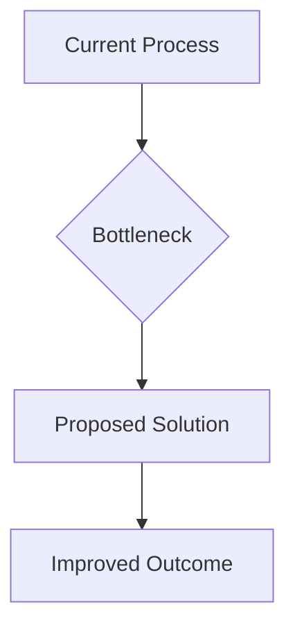

# How to Pitch Engineering Projects to Executives

As a staff engineer, you’re often at the intersection of technology and business. One key skill is pitching engineering projects effectively to executives who may not have a deep understanding of technical details but need to make informed decisions based on them. Here's how you can bridge that gap with clarity and confidence.

## Understanding Executive Priorities

Executives are primarily focused on the impact of any initiative—will it drive revenue, reduce costs, or mitigate risks? They want to know:

- **The business case:** Why should this project be prioritized over others?
- **Return on investment (ROI):** How will the project contribute to financial goals?
- **Risk management:** What are potential pitfalls and how will they be mitigated?

Your challenge is to frame your technical ideas within these priorities. Here's a step-by-step guide to crafting an executive-friendly pitch.

### 1. Simplify Technical Jargon

Start by stripping away complex jargon. Use analogies that relate to everyday experiences or business terms. For example, explain cloud computing as renting storage space instead of buying and maintaining physical servers—like choosing a rental car over owning one when you need it for a short trip.

### 2. Focus on Outcomes, Not Features

Executives care about what the project will achieve, not its technical specifics. Instead of diving into code or architecture, focus on outcomes:

- **Efficiency:** "This new system will reduce processing time by 30%, allowing us to handle double the workload."
- **Cost savings:** "By automating this process, we can cut labor costs by $500,000 annually."

### 3. Use Data and Storytelling

Combine quantitative data with storytelling to make your pitch compelling:

- **Data:** Present metrics that highlight the problem and how your project will address it.
  
  ```markdown
  - Current processing time: 5 hours per batch
  - Post-project estimate: 1 hour per batch
  ```

- **Storytelling:** Share a short narrative or case study of a similar successful implementation.

  *Imagine our customer service team being able to respond twice as fast, turning dissatisfied customers into loyal advocates.*

### 4. Visualize with Diagrams

Use simple diagrams to illustrate complex ideas. A well-designed flowchart or process map can clarify how the project will improve current operations. Tools like Mermaid make it easy to create these visuals directly in markdown:



### 5. Address Risks Head-On

Executives will be concerned about potential risks, so proactively address them:

- **Identify risks:** "The main risk is dependency on a third-party API."
- **Mitigation strategies:** "We've selected a vendor with a proven track record and have backup plans in place."

### 6. Highlight the Business Alignment

Show how your project aligns with broader business objectives, such as entering new markets or improving customer satisfaction.

- **Alignment example:** "This initiative supports our goal to become industry leaders by offering cutting-edge technology solutions."

## Key Takeaways

- Translate technical details into business language.
- Focus on outcomes and benefits rather than features.
- Use data and storytelling for a compelling narrative.
- Visual aids can simplify complex ideas.
- Proactively address potential risks.
- Align the project with company goals.

## Practical Applications

When preparing your pitch:

- **Tailor the message:** Customize your presentation based on what each executive values most (e.g., cost savings vs. innovation).
- **Practice active listening:** Understand their concerns and tailor responses accordingly.
- **Prepare a Q&A section:** Anticipate questions and prepare clear, concise answers.

## Common Pitfalls & How to Avoid Them

- **Overloading with technical details:** Keep the focus on impact, not implementation specifics.
  
  *Solution:* Always start with the business case before diving into technical explanations.

- **Ignoring risks:** Executives will see you as naive if you don't address potential downsides.
  
  *Solution:* Include a risk assessment and mitigation plan in your pitch.

- **Failing to align with goals:** Projects that don’t support overarching company objectives are less likely to get approval.
  
  *Solution:* Clearly articulate how the project supports business goals from day one.

## Further Reading & References

For those interested in honing their skills further, consider these resources:

- **"The Lean Startup" by Eric Ries** – Learn about building businesses and products efficiently.
- **"Presentation Zen" by Garr Reynolds** – Master the art of presenting ideas visually and clearly.
- **"Made to Stick" by Chip Heath & Dan Heath** – Discover techniques for crafting memorable messages.

By mastering these strategies, you'll be well-equipped to pitch your engineering projects successfully to executives, ensuring both technical excellence and business relevance.