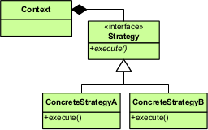

The Strategy Design Pattern offers a flexible and extensible way to manage different algorithms or behavioral variations within a system. It’s a cornerstone of good software design, particularly when dealing with complex or evolving requirements. At its core, the Strategy Pattern addresses the problem of tightly coupled code and inflexible logic by promoting loose coupling and independent modification. This significantly improves maintainability, testability, and overall design robustness. Understanding this pattern is critical for staff-level engineers tasked with building and evolving robust, adaptable systems.

## Intent

Define a family of algorithms, encapsulate each one, and make them interchangeable. Strategy allows the algorithm to vary independently from clients that use it.  This approach decouples the client from the specific implementation details of an algorithm, enabling dynamic switching and customization at runtime.  \[GoF](http://amzn.to/vep3BT)

## Problem & Motivation

Imagine a system that needs to handle various payment methods – credit card, PayPal, cryptocurrency. Without the Strategy pattern, you’d likely have a single, monolithic class managing all payment processing logic.  This creates a tightly coupled, inflexible system.  If you want to add a new payment method (e.g., Apple Pay), you’d need to modify this core class, potentially impacting other areas of the system. Furthermore, testing becomes significantly more complex, as you’d need to cover all possible payment method combinations.

The Strategy pattern elegantly solves this. By defining a common `PaymentStrategy` interface (e.g., `IPaymentStrategy`), you can implement different payment methods, each adhering to this interface. Clients can then dynamically select the appropriate strategy at runtime, without altering the core application logic. This approach aligns directly with the [Single Responsibility Principle](https://sourcemod.fandom.com/wiki/Single_Responsibility_Principle) – each class has a specific purpose, and the strategy pattern helps maintain that clarity.

## Conceptual Breakdown

Let’s delve deeper into the key concepts within the Strategy Pattern:

* **Strategy Interface:**  This defines the common interface that all strategy implementations must adhere to.  It specifies the methods that the strategy must implement (e.g., `ProcessPayment()`, `ValidateDetails()`).  This acts as the contract for all algorithm variations.

* **Concrete Strategies:** These are the specific implementations of the strategy interface. Each concrete strategy represents a particular algorithm or behavioral variation.  Examples include `CreditCardStrategy`, `PayPalStrategy`, `BitcoinStrategy`.

* **Context:** The context is the class that uses the strategy. It holds a reference to the selected strategy and delegates calls to the strategy's methods.  The context is responsible for orchestrating the execution of the chosen algorithm.

* **Dynamic Switching:** A key benefit of the Strategy pattern is the ability to switch between different strategies at runtime. This can be done through configuration, user input, or other mechanisms, providing flexibility and adaptability.


## Real-World Examples

* **Video Encoding:**  A media player could utilize the Strategy pattern to switch between different video encoding algorithms (e.g., H.264, H.265) based on the available hardware and desired quality settings.

* **Data Validation:**  A web form could employ different validation strategies (e.g., client-side validation, server-side validation) depending on the user’s input and the system's requirements.

* **Database Query Optimization:** In a database system, different query optimization strategies could be chosen based on the size of the data, the complexity of the query, and the available hardware resources.

* **Security Policies:**  A web application might dynamically switch between different security policies (e.g., stricter authentication, rate limiting) based on the perceived threat level or user privileges.


## Technical Illustration



(Image would be here - Illustrates the relationships between the Context, Strategy Interface, and Concrete Strategies).

The diagram illustrates the core relationships. The Context uses the Strategy interface, and multiple concrete strategies can be implemented and used.

## Example (C#)

```csharp
// Strategy Interface
public interface IPaymentStrategy
{
    void ProcessPayment(decimal amount, string details);
}

// Concrete Strategy: Credit Card
public class CreditCardStrategy : IPaymentStrategy
{
    public void ProcessPayment(decimal amount, string details)
    {
        Console.WriteLine($"Processing {amount} using Credit Card: {details}");
        // Implement credit card payment logic here
    }
}

// Concrete Strategy: PayPal
public class PayPalStrategy : IPaymentStrategy
{
    public void ProcessPayment(decimal amount, string details)
    {
        Console.WriteLine($"Processing {amount} using PayPal: {details}");
        // Implement PayPal payment logic here
    }
}

// Context
public class PaymentContext
{
    private IPaymentStrategy _strategy;

    public PaymentContext(IPaymentStrategy strategy)
    {
        _strategy = strategy;
    }

    public void ProcessPayment(decimal amount, string details)
    {
        _strategy.ProcessPayment(amount, details);
    }
}

// Usage Example
PaymentContext paymentContext = new PaymentContext(new CreditCardStrategy());
paymentContext.ProcessPayment(100.00m, "CC1234567890"); // Processes using Credit Card
paymentContext = new PaymentContext(new PayPalStrategy()); // Switch to PayPal
paymentContext.ProcessPayment(50.00m, "PayPalAccount"); // Processes using PayPal
```

## References

*   **Design Patterns: Elements of Reusable Object-Oriented Software** by the Gang of Four (GoF) - [http://amzn.to/vep3BT](http://amzn.to/vep3BT)

*   **Ardalis - New is Glue:** [http://ardalis.com/new-is-glue](http://ardalis.com/new-is-glue) - A key concept related to dependency injection and avoiding unnecessary instantiation.

## Call to Action

Mastering the Strategy Design Pattern is a crucial investment for any software engineer. By understanding and applying this pattern, you’ll be able to build more flexible, maintainable, and testable systems.  This directly impacts your team's velocity, reduces technical debt, and enables you to confidently adapt to evolving requirements.  Start incorporating the Strategy Pattern into your design process – it’s an essential tool for building robust and adaptable software.  Failure to deeply understand this pattern will result in systems that are brittle, difficult to change, and prone to errors, negatively impacting both development speed and system stability.


---