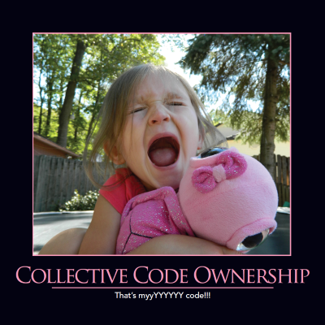

```markdown
# Collective Code Ownership: Building Resilient and Collaborative Systems



**Date:** 2024-02-29

**Description:** Collective code ownership is a software development practice that fundamentally shifts responsibility for an application’s codebase away from individual developers and onto the entire team. It’s not about eliminating individual skill; it’s about fostering a shared understanding and commitment to the health and evolution of the system. Ignoring this principle can lead to significant risks – including the dreaded bus factor, technical debt, and ultimately, system failure.

## The Problem with Fiefdoms

Traditionally, software development has often operated under a model where developers, or small teams, “own” specific pieces of code. This creates what we’ll call “fiefdoms” – areas of the codebase that are deeply understood by a limited number of individuals. While this might seem efficient in the short-term, the long-term consequences are often disastrous. Let’s consider a concrete example:

Imagine a large e-commerce platform. A small team might be responsible for the “checkout” functionality. Over time, this team’s understanding of the code – including complex integrations with third-party payment gateways, shipping providers, and inventory systems – can become extraordinarily deep. However, several key team members leave the company. Suddenly, critical functionality is at risk because nobody else truly understands how it works. This is the “bus factor” in action.  It's not just about losing a person; it’s about losing the collective knowledge and ability to maintain that part of the system.  This can manifest as a single developer being the *only* person who can deploy a feature, resolve a critical bug, or even understand the code enough to make a simple change.

Beyond the bus factor, fiefdoms lead to inconsistencies in coding standards, undocumented complexities, and a general lack of awareness of the system’s architecture.  These issues compound over time, creating significant technical debt that becomes increasingly difficult and expensive to address. 

## What is Collective Code Ownership?

Collective code ownership isn't about removing individual responsibility; it's about distributing it.  It's a mindset shift where *everyone* on the team is accountable for the entire codebase.  This doesn’t mean every engineer needs to be an expert in every aspect of the system, but it *does* mean everyone should have a basic understanding of its core components, interactions, and potential risks.

Think of it like a large, complex machine – a jet engine, for instance. No single engineer is solely responsible for the entire engine; rather, the team collectively understands its critical functions and maintains its overall health. Similarly, with software, the team collectively owns the system's integrity and future.

## Key Principles and Practices

Here’s how to implement collective code ownership effectively:

1. **Shared Coding Standards:**  Establish and rigorously enforce coding standards that are understood and followed by *everyone*. This eliminates the “clever” code that only one person can decipher.  Tools like linters and static analysis can help automate this.

2. **Common Naming Conventions:**  Utilize naming conventions that are intuitive and easily understood by the entire team. Avoid using obscure abbreviations or overly specific names.  (See our article on [Naming Things](/practices/naming-things) for more details). Consistency is paramount.

3. **Open Communication:** Foster a culture of open communication where team members feel comfortable asking questions, sharing knowledge, and providing feedback.  Regular knowledge sharing sessions and cross-training opportunities can be invaluable.

4. **Pair Programming and Mob Programming:**  These practices directly support collective code ownership by encouraging collaboration and shared understanding.  Mob programming, in particular, forces the entire team to grapple with the problem at hand, fostering a deeper understanding of the system.

5. **Documentation (Living Documentation):** Create clear and concise documentation that explains the system's architecture, key components, and design decisions.  This documentation should be accessible to everyone on the team.

## Real-World Examples

* **Netflix:** Netflix famously uses a “mob programming” approach where the entire development team works on the same code simultaneously. This dramatically reduces the risk of knowledge silos and promotes a shared understanding of the system.

* **Spotify:** Spotify leverages collective ownership to ensure that all features are well-documented and that the codebase is consistently maintained. They use a "technical blog" to document complex topics.

* **Google:** Google’s massive codebase is managed through a system of collective ownership, with engineers responsible for entire modules or services.

## Potential Pitfalls and Solutions

* **Overwhelming Complexity:**  The idea of “owning” everything can feel overwhelming. Break down the codebase into smaller, manageable modules or services.

* **Lack of Expertise:**  Not everyone needs to be an expert in every area. Embrace specialization while maintaining a basic understanding of the entire system.

* **Resistance to Change:**  Some developers may resist the idea of collective ownership, particularly if they’re accustomed to working in isolation. Address these concerns openly and demonstrate the benefits of collaboration.

## Call to Action

Mastering collective code ownership is not just about technical proficiency; it’s about building resilient, adaptable, and collaborative systems. By embracing this principle, you’ll reduce the risk of catastrophic failures, accelerate innovation, and create a more enjoyable and rewarding development experience.  Start small – choose one area of your codebase and begin applying these principles. As you gain experience, you’ll realize the profound impact that collective ownership can have on your team and your organization.  Don’t just understand the concepts; *live* them.

```