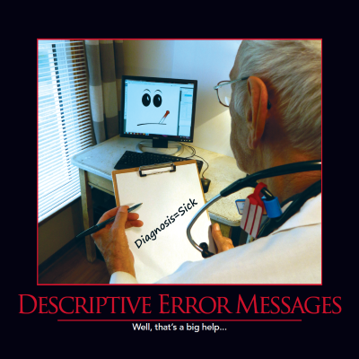

When something unexpected or exceptional happens in a software application, usually an error message is displayed to the user and/or logged somewhere for a developer to investigate. If the error is something temporary, such as a lack of a network connection, or otherwise could be overcome by the user via some troubleshooting, it should provide enough detail for the user to understand and if possible work around the problem. If the error is meant to provide diagnostic information to a developer, it should provide enough context and detail to help the developer identify the source of the issue, in order to correct it. Error messages that are neither helpful to users nor useful for developers are worse than useless, as they simply cause frustration.

For .NET developers, MSDN provides guidelines for [how to properly handle exceptions](https://msdn.microsoft.com/en-us/library/vstudio/ms229005(v=vs.100).aspx), with many examples of what _**not**_ to do. There is also a set of [exception handling best practices](https://msdn.microsoft.com/en-us/library/seyhszts(v=vs.110).aspx) on MSDN, and [another list on Code Project](http://www.codeproject.com/Articles/9538/Exception-Handling-Best-Practices-in-NET), that are both worth reviewing.

## Exception Tips

- Don't catch without throwing (unless you can correct the problem immediately)
- Don't catch and throw a new Exception (unless you wrap the original one). To log and re-throw, just use throw;
- Avoid catching generic exceptions (e.g. System.Exception) except at high levels in your app
- Create domain-specific exceptions (e.g. InventoryUnavailable) to represent known exception cases at higher abstraction levels in your app
- Make sure your exception classes are marked [Serializable] so they can be saved/sent via services
- Avoid exceptions when you can, rather than relying on them for application flow (e.g. check if a file exists before trying to write to it, rather than trying to write to it and then handling the exception when it's not there by creating the file and trying again).
- When logging, always log Exception.ToString() (or just Exception if the log framework accepts it as a parameter), not just Exception.Message!

## User Error Messages

In addition to handling exceptions at the code level, think about how error messages are presented to your application's user. These messages are a part of your user interface and experience (UI, UX); they're part of how you communicate with the user. If you've spent any care at all on UX, you don't want to ruin that effort by popping up an exception that's useless and confusing and not written for the user at all (like a stack trace). Make sure your error messages are designed for the user, are helpful when they can be, provide humor when it's appropriate, and apologize when you know they're causing the user frustration. [Ben Rowe has a nice article](http://uxmas.com/2012/the-4-hs-of-writing-error-messages) discussing specific examples of these tips and more that's worth a read if you'd like to improve your application's UX when it's not actually doing what it's supposed to do.

## References

2016 Software Craftsmanship Calendar
