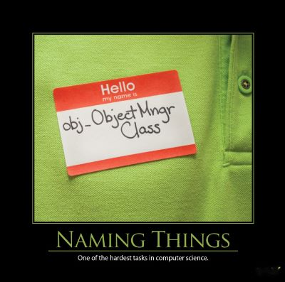

```markdown
# Naming Conventions: A Foundation for Robust Code



Choosing meaningful names for code elements is often underestimated, yet it’s a critical foundation for maintainable, understandable, and robust software. While countless articles debate this topic, the core principle remains: clear, consistent naming dramatically reduces ambiguity, improves collaboration, and ultimately, saves time and resources. Let’s explore the principles and practices that will transform your naming strategy.

## The Stakes: Why Naming Matters

Poor naming isn't just a stylistic issue; it has profound implications for your codebase. Imagine a large, complex project where developers consistently use cryptic or inconsistent names. The resulting code becomes a tangled mess, making it difficult to understand, modify, or debug. This leads to increased development time, higher risk of introducing bugs, and frustrated developers. Conversely, well-named code is self-documenting – it instantly conveys intent, making it easier to collaborate, maintain, and extend.

## Core Principles

Here's a breakdown of the key principles to guide your naming decisions:

1.  **Consistency is Paramount:** Within your team or project, establishing and adhering to a consistent naming convention is the *single most important* guideline.  Don’t let personal preferences override established standards. A consistent approach dramatically reduces cognitive load for developers.

2.  **Describe the Purpose:** Names should clearly communicate *what* a code element does, *how* it’s used, and, where appropriate, *what* the consequences are.  Aim for names that immediately tell you the purpose of the element.

3.  **Level of Abstraction:** The length of a name should match the level of abstraction it represents. Long, descriptive names are suitable for high-level concepts or variables with broad scope, while shorter names are appropriate for more granular details.

4. **Use the Ubiquitous Language:** Your team's chosen domain language (or "ubiquitous language") should guide your naming decisions. This language represents the concepts, terms, and relationships within your specific domain. Using consistent terminology improves communication and avoids misunderstandings.


## Examples: Good and Bad Practices

Let’s illustrate these principles with examples.

**Bad Examples:**

*   `d` (As in the original article) –  This is an extremely poor name. It’s ambiguous and requires a comment to explain its purpose.
*   `flag` for boolean variables - This is a common anti-pattern, masking the boolean's purpose.
*   `Util`, `Utils`, `Manager`, `Helper` – These generic prefixes obscure the element’s actual role.

**Good Examples:**

*   `elapsedTimeInDays` –  Explicitly states the unit of measurement (days) and the purpose (elapsed time).
*   `userId` –  Clearly identifies the variable's role as a unique identifier.
*   `isValidUserCredentials` - Describes the operation the method performs.

## Best Practices & Techniques

*   **Use Pronounceable Names:** Names should be easy to say and understand. This aids in verbal communication and reduces confusion.
*   **Searchable Names:** Names should be easily searchable in your IDE. Avoid overly cryptic abbreviations or symbols.
*   **Avoid Encoded Information:** Don’t include type information in names (e.g., `user_id` instead of `userId`). This is redundant and hinders readability.
*   **Consider the Domain Language:**  If your team uses terms like "customer" or "order," use them consistently in your names.

## Tools & Techniques

*   **Code Style Linters:** Tools like StyleCop (for .NET) or ESLint (for JavaScript) can enforce naming conventions and identify potential issues.
*   **IDE Features:** Most IDEs offer features for auto-completion, refactoring, and code analysis, which can be leveraged to maintain consistent naming.

## Potential Pitfalls & Anti-Patterns

*   **Mixing Opposites:** Avoid using terms like "begin" and "end" in different contexts.
*   **Over-Abstraction:** Don't create overly complex names simply to be descriptive. Strive for clarity and conciseness.
*   **The "Everything is a Variable" Trap:** Resist the temptation to create variables for every small detail. If a piece of logic is complex, consider refactoring it into a separate function or class.

## Resources & References

*   **Naming is Everything:** [http://jasonroelofs.com/2012/10/01/naming-is-everything/](http://jasonroelofs.com/2012/10/01/naming-is-everything/) - A concise and powerful overview of naming principles.
*   **Two Hard Things:** [http://martinfowler.com/bliki/TwoHardThings.html](http://martinfowler.com/bliki/TwoHardThings.html) -  A foundational concept about choosing the right level of abstraction.
*   **How To Write Unmaintainable Code:** [https://github.com/Droogans/unmaintainable-code](https://github.com/Droogans/unmaintainable-code) - A collection of bad naming examples and anti-patterns.
*   **Name Smells:** [http://www.daedtech.com/name-smells](http://www.daedtech.com/name-smells) -  A guide to identifying naming problems.
*   **.NET Guidelines for Names:** [http://msdn.microsoft.com/en-us/library/vstudio/ms229002(v=vs.100).aspx](http://msdn.microsoft.com/en-us/library/vstudio/ms229002(v=vs.100).aspx) - Specific naming guidelines for .NET development.
*   **Clean Code:** [http://amzn.to/YjUDI0](http://amzn.to/YjUDI0) - Robert C. Martin’s guide to writing clean and maintainable code.
*   **Code Complete:** [http://amzn.to/Vq5YLv](http://amzn.to/Vq5YLv) - Steve McConnell’s comprehensive guide to software construction.


## Call to Action

Mastering the art of naming is a critical skill for any software developer. By consistently applying these principles and practices, you’ll significantly improve your code's readability, maintainability, and overall quality.  Start today – review your current codebase and identify areas where you can improve your naming conventions.  Investing in this area will directly impact your team's collaboration, reduce technical debt, and ultimately, deliver higher-quality software.


    ---
```