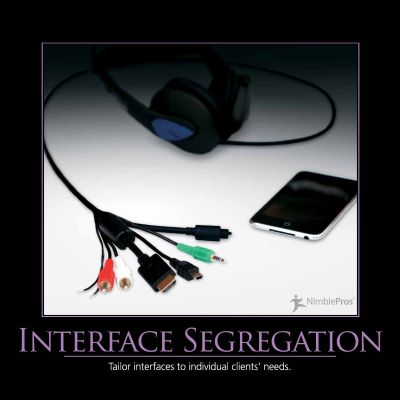

```markdown
# The Interface Segregation Principle: Designing for Flexibility and Maintainability

**Date:** 2024-02-29
**Description:** The Interface Segregation Principle (ISP) is a cornerstone of SOLID design, advocating for the creation of small, focused interfaces. It states that clients should not be forced to depend on methods they don't use.  Violating this principle leads to coupled, brittle systems – difficult to maintain, extend, and test.  As a staff engineer, understanding and applying the ISP isn't just about writing "good" code; it's about building systems that can withstand change, adapt to new requirements, and scale effectively.  Failure to do so significantly increases the risk of technical debt and operational challenges.



## The Problem with “Fat” Interfaces

Let's consider a scenario. You're building an e-commerce platform. Initially, you define a `Membership` interface to handle user authentication and account management. This interface, let's call it `IUserAccount`, includes methods for `Login()`, `Logout()`, `Register()`, `ForgotPassword()`, and `UpdateProfile()`.  It’s a “fat” interface – offering a broad range of functionalities.

Initially, this seems reasonable. However, as the system evolves, you realize that only the login and logout functionality is actually needed for the core user authentication flow. The registration and password reset features are handled by a separate service. This creates a mismatch. The `IUserAccount` interface is now bloated with methods that aren’t used by the core authentication logic, leading to unnecessary complexity and potential code duplication.

**Real-World Implications:**

*   **Increased Coupling:** Developers relying on `IUserAccount` are forced to implement methods they don’t need, leading to tighter coupling between components.
*   **Higher Maintenance Costs:**  As new features are added or existing ones change, modifying `IUserAccount` has a ripple effect, potentially impacting numerous parts of the system.
*   **Testing Challenges:**  Testing components that depend on a large, bloated interface becomes more difficult, increasing the risk of regressions.
*   **Performance Issues:** Unused methods add unnecessary overhead, potentially impacting performance.

**A Better Approach:  Creating Specialized Interfaces**

Instead of a single, monolithic `IUserAccount`, we can break it down into smaller, more focused interfaces:

*   `ILogin`: Handles authentication-specific operations like `Login()` and `Logout()`.
*   `IUserProfile`:  Manages user profile information – `UpdateProfile()`.
*   `IRegistration`:  Deals with user registration – `Register()`.
*   `IForgotPassword`: Manages password recovery – `ForgotPassword()`.

```java
// ILogin Interface
public interface ILogin {
    bool Login(string username, string password);
    void Logout(string username);
}

// IRegistration Interface
public interface IRegistration {
    Guid Register(string username, string password, string email);
}

// IForgotPassword Interface
public interface IForgotPassword {
    void ForgotPassword(string username);
}

// IUserAccount Interface
public interface IUserAccount : ILogin, IRegistration, IForgotPassword {
    // Potentially add common functionality here, if needed
}
```

**Benefits of this approach:**

*   **Reduced Coupling:** Components that need only authentication functionality depend only on `ILogin`.
*   **Improved Maintainability:** Changes to password reset logic only affect `IForgotPassword`, minimizing the impact on other parts of the system.
*   **Enhanced Testability:** Testing becomes simpler, as you can isolate and verify the functionality of specific interfaces.
*   **Increased Reusability:** Individual interfaces can be reused in different contexts.

## Connections to Related Principles

*   **Liskov Substitution Principle:**  This ISP closely relates to the LSP. By creating specialized interfaces, you ensure that subclasses can be substituted without violating behavioral contracts.
*   **Dependency Inversion Principle:** The ISP supports DIP by promoting loose coupling between modules, avoiding direct dependencies on concrete implementations.
*   **Repository Pattern:**  As mentioned earlier, the Repository pattern frequently benefits from the ISP. A `IReadOnlyRepository` interface could manage read operations (e.g., `GetById()`, `GetAll()`) while `IWriteRepository` handles write operations (e.g., `Save()`, `Update()`).

## Practical Considerations & Anti-Patterns

*   **Over-Specialization:** Avoid creating an excessive number of tiny interfaces.  Strive for a balance between specialization and simplicity.
*   **Interface Merging:** Don't blindly merge interfaces. Carefully consider the trade-offs and potential impact on downstream components.
*   **Domain-Driven Design (DDD):** The ISP aligns perfectly with DDD principles, encouraging the creation of interfaces that mirror domain concepts.

## Conclusion

The Interface Segregation Principle is more than just a coding guideline; it’s a strategic approach to system design. By embracing specialization and minimizing coupling, you can create systems that are more robust, adaptable, and sustainable.  As a staff engineer, consistently applying the ISP helps prevent technical debt, reduces operational risk, and ultimately empowers your team to deliver higher-quality solutions. Mastering this principle will significantly improve your ability to design and maintain complex software systems.
```