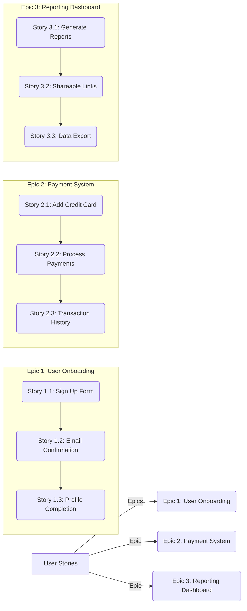

# Story Mapping & Story Splitting

Welcome to the world of story mapping and story splitting—your new best friends in software development! These techniques are like a GPS for delivering projects efficiently. They help you break down big, overwhelming tasks into manageable pieces that your team can tackle with confidence.

Imagine your project is a giant chocolate bar. You wouldn’t eat it all at once, right? Instead, you'd split it up and savor each piece. That's exactly what story mapping and splitting do for software development.

## What Is Story Mapping?

Story mapping is a visual technique that helps teams understand the "big picture" of a project before diving into details. It involves laying out all user stories—small, actionable tasks—on a board or digital workspace to see how they fit together in achieving the end goal.

### Why Use Story Mapping?

- **Clarity:** Visualizing the entire journey clarifies what needs to be done and its order.
- **Prioritization:** Easily spot which features are crucial and should be delivered first.
- **Collaboration:** Facilitates team discussions, ensuring everyone is on the same page.

Here's how you might visualize it:



## What Is Story Splitting?

Once you've mapped out your stories, story splitting comes into play. This process involves breaking down large user stories into smaller, more manageable pieces that can be completed in a short timeframe—usually within one to two weeks.

### Why Use Story Splitting?

- **Manageability:** Smaller tasks are easier for teams to manage and deliver.
- **Flexibility:** Teams can adapt quickly to changes without being overwhelmed.
- **Momentum:** Small wins build momentum and boost team morale.

Imagine you have a story like "Implement user authentication." It's too big, right? Here’s how you might split it:

```markdown
1. Set up the database for storing user credentials.
2. Implement login form on the frontend.
3. Create backend logic to verify credentials.
4. Add functionality for password reset emails.
```

## Key Takeaways

- **Visualize First:** Use story mapping to see the big picture and understand priorities.
- **Break It Down:** Apply story splitting to convert large stories into smaller tasks.
- **Facilitate Communication:** Both techniques improve team discussions and alignment.

# Practical Applications

As a Staff Engineer, you’ll often find yourself orchestrating complex projects. Here’s how these techniques fit in:

- **Scoping Projects:** Use story mapping during initial planning sessions to scope out what needs to be built.
- **Daily Stand-Ups:** Reference the split stories to track progress and identify blockers.
- **Retrospectives:** Assess how well stories were mapped and split to refine future practices.

**Real-world Example:** Suppose your team is building an e-commerce platform. Start by mapping out epics like "User Registration," "Product Listings," and "Checkout Process." Then, break down each epic into actionable stories—like creating a registration form or setting up payment gateways—that can be developed iteratively.

# Common Pitfalls & How to Avoid Them

- **Overcomplicating Stories:** Don’t try to fit too many details into one story. Split complex tasks early.
  - *Solution:* Regularly review your backlog and refine stories during grooming sessions.
  
- **Ignoring Dependencies:** Overlooking dependencies can lead to bottlenecks.
  - *Solution:* Use the map to highlight and address dependencies before development begins.

- **Lack of Team Involvement:** Story mapping should be a collaborative exercise.
  - *Solution:* Engage all team members in the mapping session to gather diverse insights.

# Further Reading & References

For those who want to dive deeper into story mapping and splitting:

- **"User Stories Applied: For Agile Software Development" by Mike Cohn** – An essential read for understanding how to write effective user stories.
- **Online Story Mapping Tools:** Explore tools like Miro or Jira’s roadmap feature to visualize your project.

Remember, mastering story mapping and splitting can transform the way your team delivers software. So next time you face a daunting task, think of it as just another chocolate bar—ready to be savored one piece at a time!